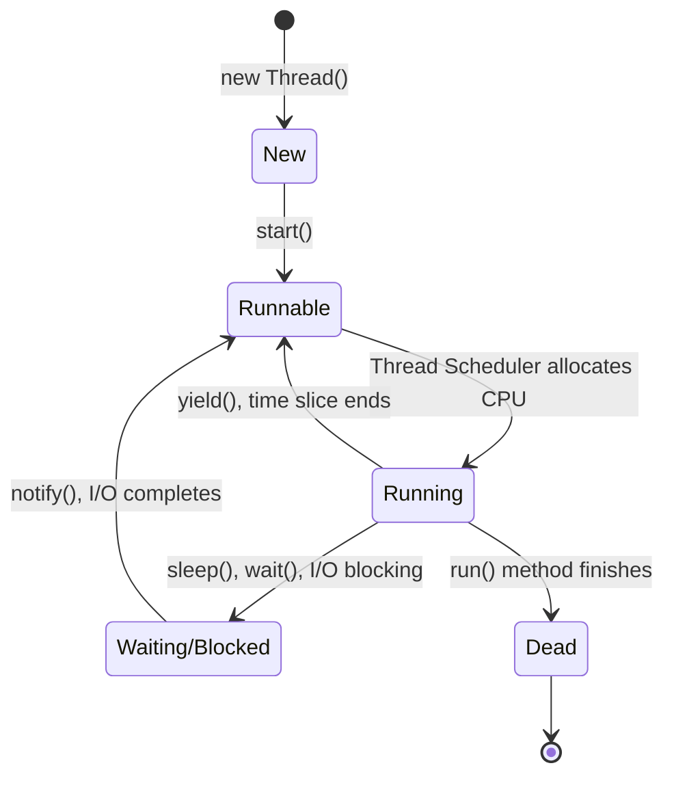

# Day 10: Multi-Threaded Programming

Welcome to Day 10! By default, a Java program runs on a single thread (the `main` thread), meaning it executes one task at a time. However, modern computers have multi-core processors. To utilize the full power of your CPU and make applications responsive, we use **Multi-threading**.

---

## 🧵 1. What is a Thread?

A thread is a lightweight sub-process, the smallest unit of processing. Multithreading is the process of executing multiple threads simultaneously.

### Concept: Multitasking vs Multithreading

- **Process-based Multitasking (Multiprocessing):** Running multiple programs at once (e.g., typing in Word while listening to Spotify). Heavyweight, distinct memory spaces.
- **Thread-based Multitasking (Multithreading):** Running multiple parts of the *same* program at once (e.g., a browser downloading a file in one thread while you scroll a web page in another). Lightweight, shared memory space.

### Thread Life Cycle



---

## 🛠️ 2. Creating Threads in Java

There are two primary ways to create a thread in Java:
1. Extending the `Thread` class.
2. Implementing the `Runnable` interface.

### Method 1: Extending `Thread`
```java
class MyThread extends Thread {
    // You MUST override the run() method
    public void run() {
        for (int i = 0; i < 5; i++) {
            System.out.println("Thread running: " + i);
            try {
                Thread.sleep(500); // Pause for 500ms
            } catch (InterruptedException e) {
                System.out.println(e);
            }
        }
    }
}

public class Main {
    public static void main(String[] args) {
        MyThread t1 = new MyThread();
        // DON'T call t1.run(). Call t1.start() to actually create a new OS thread!
        t1.start(); 
        
        System.out.println("Main thread is also running!");
    }
}
```

### Method 2: Implementing `Runnable` (Recommended)
Because Java doesn't support multiple inheritance, implementing `Runnable` is better because your class can still extend another class if needed.

```java
class MyRunnable implements Runnable {
    public void run() {
        System.out.println("Runnable thread is running...");
    }
}

public class Main {
    public static void main(String[] args) {
        MyRunnable myRun = new MyRunnable();
        // You have to pass the runnable object into a new Thread
        Thread t1 = new Thread(myRun);
        t1.start();
    }
}
```

---

## 🔒 3. Thread Synchronization

When multiple threads try to access and modify the same shared resource at the same time, it can lead to data inconsistency (Race Conditions). We use **Synchronization** to prevent this.

The `synchronized` keyword ensures that only one thread can execute a block of code or a method at a given time on a specific object.

### Code Example (Without Synchronization - Data Loss)
```java
class Counter {
    int count = 0;
    // Without 'synchronized', threads overwrite each other's updates
    public synchronized void increment() {
        count++;
    }
}
```
If you mark the method `synchronized`, Java places a lock on the `Counter` object. Thread B must wait for Thread A to finish incrementing before Thread B can increment.

---

## ⚖️ 4. `wait()` vs `sleep()`

Both pause execution, but they are very different!

| Feature | `sleep(ms)` | `wait()` |
| :--- | :--- | :--- |
| **Defined in** | `Thread` class | `Object` class |
| **Lock Behavior** | Does **not** release the lock on the object | **Releases** the lock, allowing other threads to enter the synchronized block |
| **Wake up** | Wakes up automatically after the specified time | Wakes up only when `notify()` or `notifyAll()` is called by another thread |
| **Context** | Can be called anywhere | Must be called inside a `synchronized` block |

---

## 📝 Learning & Assignments
- **Learning:** Go to the `Learning/` folder to run simulations of Race Conditions and see how `synchronized` fixes them.
- **Assignments:** Complete the exercises in `Assignments/`. Try creating a simple Producer-Consumer problem using `wait()` and `notify()`.
