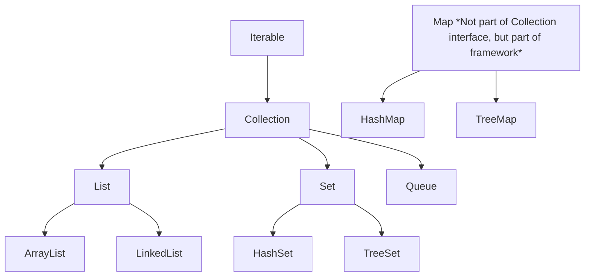

# Day 11: Predefined Libraries (String, Math, and Collections)

Welcome to Day 11! Java comes with a massive standard library (the Java API). Instead of reinventing the wheel, we use predefined classes to handle common tasks like String manipulation, mathematical operations, and data structures.

---

## 🧵 1. The `String` Class

In Java, strings are not primitive types; they are objects backed by the `java.lang.String` class.

### Immutability
Strings in Java are **Immutable**. This means once a String object is created, its data or state cannot be changed. If you try to modify it, a *new* String object is created in memory instead.

```mermaid
graph LR
    subgraph String Pool (Heap)
        A["Hello"]
        B["HelloWorld"]
    end
    
    Ref1[String s = "Hello"] --> A
    Ref2[s = s + "World"] -.-> B
    Note right of Ref2: A new object is created.<br>The original "Hello" is untouched.
```

### Common String Methods
| Method | Description | Example | Result |
| :--- | :--- | :--- | :--- |
| `length()` | Returns number of characters | `"Java".length()` | `4` |
| `charAt(index)` | Returns character at index | `"Java".charAt(1)` | `'a'` |
| `substring(begin, end)` | Extracts a portion of the string | `"Hello".substring(1, 4)` | `"ell"` |
| `equals(str)` | Compares content | `"hi".equals("Hi")` | `false` |
| `equalsIgnoreCase(str)`| Compares ignoring case | `"hi".equalsIgnoreCase("Hi")`| `true` |

> [!WARNING]
> **`==` vs `.equals()`:** Always use `.equals()` to compare strings! `==` compares the *memory address* (reference), while `.equals()` compares the actual text content.

### `StringBuilder` and `StringBuffer`
If you need to modify a string frequently (e.g., in a loop), use `StringBuilder` (faster, not thread-safe) or `StringBuffer` (slower, thread-safe) because they are **mutable** (can be changed without creating new objects).

---

## 🧮 2. The `Math` Class

The `java.lang.Math` class contains methods for performing basic numeric operations. All methods in the `Math` class are `static`, meaning you call them directly on the class itself.

| Method | Description | Example | Result |
| :--- | :--- | :--- | :--- |
| `Math.max(a, b)` | Returns the highest value | `Math.max(5, 10)` | `10` |
| `Math.min(a, b)` | Returns the lowest value | `Math.min(5, 10)` | `5` |
| `Math.sqrt(x)` | Returns the square root | `Math.sqrt(64)` | `8.0` |
| `Math.pow(a, b)` | Returns `a` to the power of `b` | `Math.pow(2, 3)` | `8.0` |
| `Math.abs(x)` | Returns the absolute (positive) value | `Math.abs(-4.7)` | `4.7` |
| `Math.random()` | Returns a random double between 0.0 and 1.0| `Math.random()` | e.g. `0.234` |

---

## 📦 3. The Collections Framework

While arrays are great, they have a fixed size. The Java Collections Framework provides dynamic data structures that can grow and shrink automatically.

### Collections Hierarchy



### Key Interfaces

| Interface | Description | Implementations |
| :--- | :--- | :--- |
| **List** | An ordered collection that allows duplicate elements. | `ArrayList`, `LinkedList` |
| **Set** | A collection that does NOT allow duplicate elements. | `HashSet`, `TreeSet` |
| **Map** | An object that maps keys to values. Keys cannot be duplicated. | `HashMap`, `TreeMap` |

### Code Example: ArrayList
```java
import java.util.ArrayList;

public class Main {
    public static void main(String[] args) {
        ArrayList<String> cars = new ArrayList<String>();
        cars.add("Volvo"); // Adds element
        cars.add("BMW");
        
        System.out.println(cars.get(0)); // Accesses element: Volvo
        System.out.println(cars.size()); // Array size: 2
        
        cars.remove("BMW"); // Removes element
    }
}
```

---

## 📝 Learning & Assignments
- **Learning:** Go to the `Learning/` folder to run examples of String manipulation and ArrayList operations.
- **Assignments:** Complete the `Assignments/` folder exercises. Try building a program that counts the frequency of words in a sentence using a `HashMap`.
