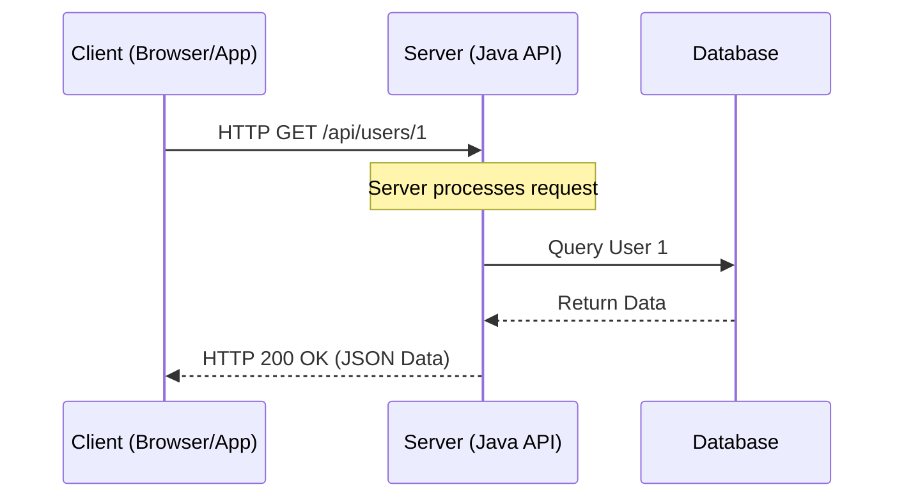

# Day 13: REST (Representational State Transfer)

Welcome to Day 13, the final day of our Java core series! Now that you have mastered core Java, it's time to communicate with the outside world. To do this, modern applications use **REST APIs**.

---

## 🌐 1. What is an API and REST?

**API (Application Programming Interface):** A set of rules that allows one piece of software to talk to another. 
**REST (Representational State Transfer):** An architectural style for designing networked applications. It relies on a stateless, client-server, cacheable communications protocol — virtually always HTTP.

### How REST Works



---

## 🛠️ 2. HTTP Methods

REST relies heavily on standard HTTP methods to perform CRUD (Create, Read, Update, Delete) operations.

| HTTP Method | CRUD Operation | Description |
| :--- | :--- | :--- |
| **GET** | Read | Retrieve data from the server. Should never modify data. |
| **POST** | Create | Send data to the server to create a new resource. |
| **PUT** | Update | Update an existing resource (usually replaces it entirely). |
| **DELETE**| Delete | Remove a resource from the server. |

---

## 📦 3. JSON (JavaScript Object Notation)

When communicating via REST APIs, data is usually transferred in **JSON** format. JSON is lightweight and easy for humans to read and machines to parse.

### JSON Example
```json
{
  "id": 1,
  "name": "Alice",
  "role": "Developer",
  "skills": ["Java", "SQL", "REST"]
}
```

---

## ☕ 4. Making REST Calls in Java (HttpClient)

Since Java 11, Java has a built-in `java.net.http.HttpClient` to make HTTP requests and handle responses easily.

### Example: Making a GET Request

```java
import java.net.URI;
import java.net.http.HttpClient;
import java.net.http.HttpRequest;
import java.net.http.HttpResponse;

public class RestClientExample {
    public static void main(String[] args) {
        // 1. Create an HttpClient
        HttpClient client = HttpClient.newHttpClient();
        
        // 2. Build the Request
        HttpRequest request = HttpRequest.newBuilder()
                .uri(URI.create("https://jsonplaceholder.typicode.com/posts/1"))
                .GET() // Default is GET, so this is optional
                .build();
        
        try {
            // 3. Send the Request and receive the Response
            HttpResponse<String> response = client.send(request, HttpResponse.BodyHandlers.ofString());
            
            // 4. Print the status code and body
            System.out.println("Status Code: " + response.statusCode());
            System.out.println("Response Body: \n" + response.body());
            
        } catch (Exception e) {
            e.printStackTrace();
        }
    }
}
```

---

## 🚀 5. What's Next? (Spring Boot)

Writing your own REST *Client* (like the example above) is easy. But how do you build a REST *Server* in Java?

In the real world, Java developers do not write HTTP servers from scratch. We use frameworks, the most popular being **Spring Boot**. 
With Spring Boot, creating a REST endpoint is as simple as:

```java
@RestController
public class UserController {

    @GetMapping("/api/hello")
    public String sayHello() {
        return "Hello, REST World!";
    }
}
```

---

## 📝 Learning & Assignments
- **Learning:** Go to the `Learning/` folder to run the `HttpClient` examples and fetch real data from public APIs.
- **Assignments:** Complete the `Assignments/` folder exercises. Try making a POST request to a public test API, and see if you get a `201 Created` status code back!

---
## 🎉 Congratulations!
You have successfully completed the 13-day Core Java Curriculum! Keep practicing, and happy coding!
