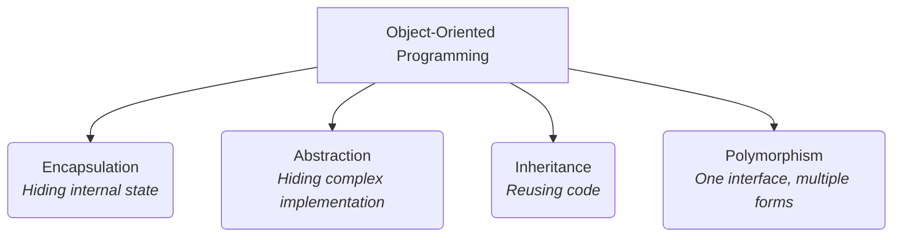
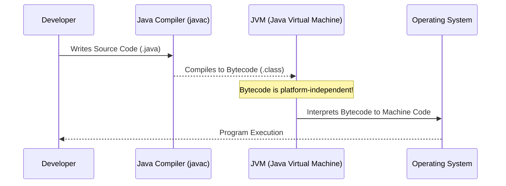

# Day 1: Introduction to OOP and Java

Welcome to Day 1! Today, we lay the foundation of Java programming by understanding the core philosophy behind it: Object-Oriented Programming (OOP). We will also write our very first Java program and learn how to take input from the user.

---

## 📖 1. What is Object-Oriented Programming (OOP)?

Object-Oriented Programming is a programming paradigm based on the concept of **"objects"**, which can contain data and code: data in the form of fields (often known as attributes or properties), and code, in the form of procedures (often known as methods).

### Real-world Analogy
Think of a **Car**.
- **State (Data):** Color, model, current speed.
- **Behavior (Methods):** Accelerate, brake, honk.

### The 4 Pillars of OOP



| Concept | Definition | Example |
| :--- | :--- | :--- |
| **Encapsulation** | Wrapping data and methods into a single unit (class) to prevent unauthorized access. | A capsule containing medicine; using `private` variables with getters/setters. |
| **Abstraction** | Hiding implementation details and showing only functionality to the user. | Driving a car without knowing how the internal combustion engine works. |
| **Inheritance** | A mechanism where a new class inherits properties and behaviors of an existing class. | A `Dog` class inheriting from an `Animal` class. |
| **Polymorphism** | The ability of a variable, function, or object to take on multiple forms. | A `draw()` method that draws a circle, square, or triangle depending on the object. |

---

## ☕ 2. Introduction to Java

Java is a high-level, class-based, object-oriented programming language designed to have as few implementation dependencies as possible. Its famous slogan is **"Write Once, Run Anywhere" (WORA)**.

### How Java Works (JVM Architecture)

When you write a Java program, it goes through a multi-step process to run on your machine:



### Key Differences: Java vs C++

| Feature | Java | C++ |
| :--- | :--- | :--- |
| **Platform Dependency** | Platform Independent (Bytecode) | Platform Dependent (Compiled to Machine Code) |
| **Memory Management** | Automatic (Garbage Collector) | Manual (Pointers, `malloc`, `free`) |
| **Inheritance** | Single Inheritance (Multiple via Interfaces) | Multiple Inheritance |

---

## 💻 3. Hello World: Your First Program

Let's dissect the classic "Hello World" program in Java.

```java
public class HelloWorld {
    public static void main(String[] args) {
        System.out.println("Hello, World!");
    }
}
```

### Line-by-Line Breakdown:
- `public class HelloWorld`: Declares a class named `HelloWorld`. In Java, all code must reside inside a class. `public` means it is accessible from anywhere.
- `public static void main(String[] args)`: The entry point of any Java application.
  - `public`: JVM needs access to execute this method.
  - `static`: Allows the JVM to invoke the method without instantiating the class.
  - `void`: The method does not return any value.
  - `String[] args`: Command-line arguments passed to the program as an array of Strings.
- `System.out.println("Hello, World!");`: Prints the text to the console.
  - `System`: A built-in class.
  - `out`: A static member of the `System` class representing the standard output stream.
  - `println()`: A method that prints a message and then terminates the line.

---

## ⌨️ 4. Taking User Input

To read input from the console, Java provides the `Scanner` class located in the `java.util` package.

```java
import java.util.Scanner; // Import the Scanner class

public class UserInputExample {
    public static void main(String[] args) {
        // Create a Scanner object to read from standard input (keyboard)
        Scanner scanner = new Scanner(System.in);
        
        System.out.print("Enter your name: ");
        String name = scanner.nextLine(); // Reads a string input
        
        System.out.println("Welcome, " + name + "!");
        
        // Always close the scanner to prevent memory leaks
        scanner.close(); 
    }
}
```

### Common Scanner Methods
| Method | Description |
| :--- | :--- |
| `nextLine()` | Reads a complete line of text (String). |
| `nextInt()` | Reads an integer value. |
| `nextDouble()` | Reads a double (decimal) value. |
| `nextBoolean()` | Reads a boolean value (true/false). |

> [!WARNING]
> **The `nextLine()` trap:** If you use `nextInt()` and then `nextLine()`, the `nextLine()` will consume the leftover newline character (`\n`) from the enter key. To fix this, always put an extra `scanner.nextLine()` after `nextInt()` to clear the buffer!

---

## 📝 Learning & Assignments
- **Learning:** Check the `Learning/` folder for compilable examples of everything discussed above.
- **Assignments:** Complete the tasks in the `Assignments/` folder to practice taking various types of inputs and printing formatted outputs.
