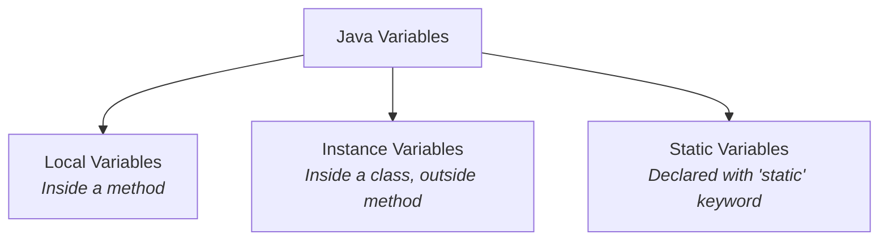

# Day 2: Variables, Datatypes, and Arrays

Welcome to Day 2! Today we focus on how Java stores and manages data. To write any meaningful program, you need to store information in memory, manipulate it, and retrieve it. This is where variables, datatypes, and arrays come into play.

---

## 📦 1. Variables

A **variable** is a named memory location used to store data. In Java, every variable must be declared with a specific data type before it can be used (statically typed).

### Syntax
```java
datatype variableName = value;
```

### Types of Variables in Java



| Type | Scope | Memory Allocation | Lifetime |
| :--- | :--- | :--- | :--- |
| **Local** | Inside the method or block where declared. | Stack | Destroyed when method ends. |
| **Instance** | Throughout the class (via object). | Heap | Destroyed when object is garbage collected. |
| **Static** | Throughout the class (shared across objects). | Static/Method Area | Destroyed when program ends. |

---

## 🧬 2. Data Types

Data types specify the size and type of values that can be stored in a variable. Java has two major categories of data types: **Primitive** and **Non-Primitive (Reference)**.

### Hierarchy of Data Types

```mermaid
graph TD
    DT[Data Types]
    DT --> P[Primitive Types]
    DT --> NP[Non-Primitive Types]
    
    P --> B[Boolean]
    P --> N[Numeric]
    
    N --> Char[Character (char)]
    N --> I[Integral]
    
    I --> Byte[byte]
    I --> Short[short]
    I --> Int[int]
    I --> Long[long]
    
    I --> F[Floating-Point]
    F --> Float[float]
    F --> Double[double]
    
    NP --> String[String]
    NP --> Array[Arrays]
    NP --> Class[Classes / Objects]
```

### Primitive Data Types Table

| Data Type | Size | Description/Value Range | Default Value |
| :--- | :--- | :--- | :--- |
| `boolean` | 1 bit | Stores `true` or `false` | `false` |
| `byte` | 1 byte | -128 to 127 | `0` |
| `short` | 2 bytes | -32,768 to 32,767 | `0` |
| `char` | 2 bytes | Stores a single 16-bit Unicode character | `\u0000` |
| `int` | 4 bytes | ~ -2 Billion to 2 Billion | `0` |
| `long` | 8 bytes | Huge whole numbers. Postfix with `L` (e.g., `100L`) | `0L` |
| `float` | 4 bytes | 6-7 decimal digits. Postfix with `f` (e.g., `5.5f`) | `0.0f` |
| `double` | 8 bytes | 15 decimal digits. Default for decimals. | `0.0d` |

### Primitive vs Non-Primitive

| Feature | Primitive | Non-Primitive (Reference) |
| :--- | :--- | :--- |
| **Storage** | Stores the actual value directly in memory (Stack). | Stores a reference/memory address pointing to the object (Heap). |
| **Null values** | Cannot be `null`. | Can be `null`. |
| **Methods** | Do not have methods. | Can have methods to perform operations. |
| **Casing** | Starts with lowercase (e.g., `int`). | Starts with Uppercase (e.g., `String`). |

---

## 📚 3. Arrays

An **array** is a container object that holds a fixed number of values of a **single type**. The length of an array is established when the array is created. After creation, its length is fixed.

### 1D Array Example

```java
// Declaration
int[] numbers;

// Allocation
numbers = new int[5]; // Array of size 5

// Initialization
numbers[0] = 10;
numbers[1] = 20;

// Declaration & Initialization in one line
String[] names = {"Alice", "Bob", "Charlie"};

// Accessing an element
System.out.println(names[0]); // Outputs: Alice
```

### Array Memory Allocation Diagram
When `int[] arr = {10, 20, 30};` is executed:

```mermaid
graph LR
    Stack[Stack Memory] --> |arr reference| Heap[Heap Memory]
    subgraph Heap[Heap Memory]
        A0[arr[0] : 10]
        A1[arr[1] : 20]
        A2[arr[2] : 30]
    end
```

### Multidimensional Arrays (2D Arrays)
A 2D array is an array of arrays, often used to represent matrices or grids.

```java
// Declaration & Initialization of a 3x3 matrix
int[][] matrix = {
    {1, 2, 3},
    {4, 5, 6},
    {7, 8, 9}
};

// Accessing row 1, column 2 (0-indexed)
System.out.println(matrix[1][2]); // Outputs: 6
```

> [!TIP]
> **Array Length Property:** You can find the size of an array using the `.length` property. Note that it is a property, not a method, so you don't use parentheses (e.g., `numbers.length`).

---

## 📝 Learning & Assignments
- **Learning:** Go to the `Learning/` folder to run code examples showing the differences between primitives and how arrays are structured.
- **Assignments:** Complete the `Assignments/` folder exercises to practice declaring variables, swapping values, and manipulating array indices.
