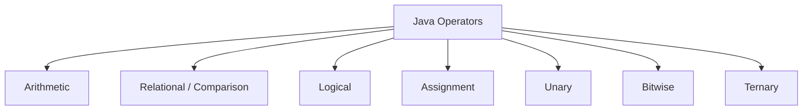

# Day 3: Operators in Java

Welcome to Day 3! Now that we know how to store data using variables, it's time to manipulate that data. We do this using **Operators**.

An operator is a special symbol that performs specific operations on one, two, or three operands, and then returns a result.

---

## ⚙️ 1. Types of Operators

Java provides a rich set of operators to manipulate variables. We can categorize them as follows:



### ➕ Arithmetic Operators
Used to perform basic mathematical operations.

| Operator | Description | Example (`A=10, B=20`) | Result |
| :---: | :--- | :--- | :--- |
| `+` | Addition | `A + B` | `30` |
| `-` | Subtraction | `A - B` | `-10` |
| `*` | Multiplication | `A * B` | `200` |
| `/` | Division | `B / A` | `2` |
| `%` | Modulo (Remainder) | `B % A` | `0` |

> [!NOTE]
> When performing division `/` between two integers, Java truncates the decimal portion. E.g., `5 / 2` is `2`. To get a decimal, at least one operand must be a float or double: `5.0 / 2` is `2.5`.

### ⚖️ Relational (Comparison) Operators
Used to compare two values. They always return a `boolean` (`true` or `false`).

| Operator | Description | Example (`A=10, B=20`) | Result |
| :---: | :--- | :--- | :--- |
| `==` | Equal to | `A == B` | `false` |
| `!=` | Not equal to | `A != B` | `true` |
| `>` | Greater than | `A > B` | `false` |
| `<` | Less than | `A < B` | `true` |
| `>=` | Greater than or equal | `A >= B` | `false` |
| `<=` | Less than or equal | `A <= B` | `true` |

### 🧠 Logical Operators
Used to combine multiple boolean expressions.

| Operator | Name | Description | Example |
| :---: | :--- | :--- | :--- |
| `&&` | Logical AND | `true` if **both** conditions are true | `(5 > 3) && (8 > 5)` -> `true` |
| `\|\|` | Logical OR | `true` if **at least one** condition is true | `(5 > 3) \|\| (8 < 5)` -> `true` |
| `!` | Logical NOT | Reverses the boolean state | `!(5 > 3)` -> `false` |

> [!TIP]
> **Short-circuiting:** 
> - For `&&`, if the first condition is `false`, Java does not evaluate the second condition (because the whole expression will be `false` anyway).
> - For `||`, if the first condition is `true`, Java does not evaluate the second condition.

### 📝 Assignment Operators
Used to assign values to variables.

| Operator | Equivalent To | Example |
| :---: | :--- | :--- |
| `=` | Assignment | `c = a + b` |
| `+=` | `c = c + a` | `c += a` |
| `-=` | `c = c - a` | `c -= a` |
| `*=` | `c = c * a` | `c *= a` |
| `/=` | `c = c / a` | `c /= a` |

### 🔄 Unary Operators
Operators that require only one operand.

| Operator | Description | Example (`A = 10`) |
| :---: | :--- | :--- |
| `+` | Unary plus (indicates positive value) | `+A` -> `10` |
| `-` | Unary minus (negates value) | `-A` -> `-10` |
| `++` | Increment (increases value by 1) | `A++` or `++A` -> `11` |
| `--` | Decrement (decreases value by 1) | `A--` or `--A` -> `9` |
| `!` | Logical Complement (inverts boolean) | `!true` -> `false` |

**Pre-increment (`++A`) vs Post-increment (`A++`)**
- **Pre-increment:** Increases the value first, then uses it in the expression.
- **Post-increment:** Uses the current value in the expression first, then increases it.

```java
int x = 5;
int y = ++x; // x becomes 6, then y becomes 6.
System.out.println("x: " + x + ", y: " + y); // x: 6, y: 6

int a = 5;
int b = a++; // b becomes 5, then a becomes 6.
System.out.println("a: " + a + ", b: " + b); // a: 6, b: 5
```

### 🔀 Ternary Operator
A shorthand for an `if-else` statement. It takes three operands.

**Syntax:** `condition ? value_if_true : value_if_false;`

```java
int a = 10;
int b = 20;

// Find the maximum
int max = (a > b) ? a : b; // Reads: If a > b, return a. Else, return b.
System.out.println("Max is: " + max); // Outputs 20
```

---

## ⚖️ 2. Operator Precedence

When multiple operators are used in a single expression, the order of execution is determined by operator precedence.

*Highest precedence evaluates first.*
1. Postfix: `expr++`, `expr--`
2. Unary: `++expr`, `--expr`, `+expr`, `-expr`, `~`, `!`
3. Multiplicative: `*`, `/`, `%`
4. Additive: `+`, `-`
5. Shift: `<<`, `>>`, `>>>`
6. Relational: `<`, `>`, `<=`, `>=`, `instanceof`
7. Equality: `==`, `!=`
8. Logical AND: `&&`
9. Logical OR: `||`
10. Ternary: `? :`
11. Assignment: `=`, `+=`, `-=`, etc.

> Use parentheses `()` to explicitly dictate evaluation order and make code readable! E.g., `(a + b) * c`.

---

## 📝 Learning & Assignments
- **Learning:** Review the code examples in the `Learning/` folder to see all these operators in action.
- **Assignments:** Complete the `Assignments/` folder exercises to practice complex mathematical expressions and logic gates simulation using operators.
