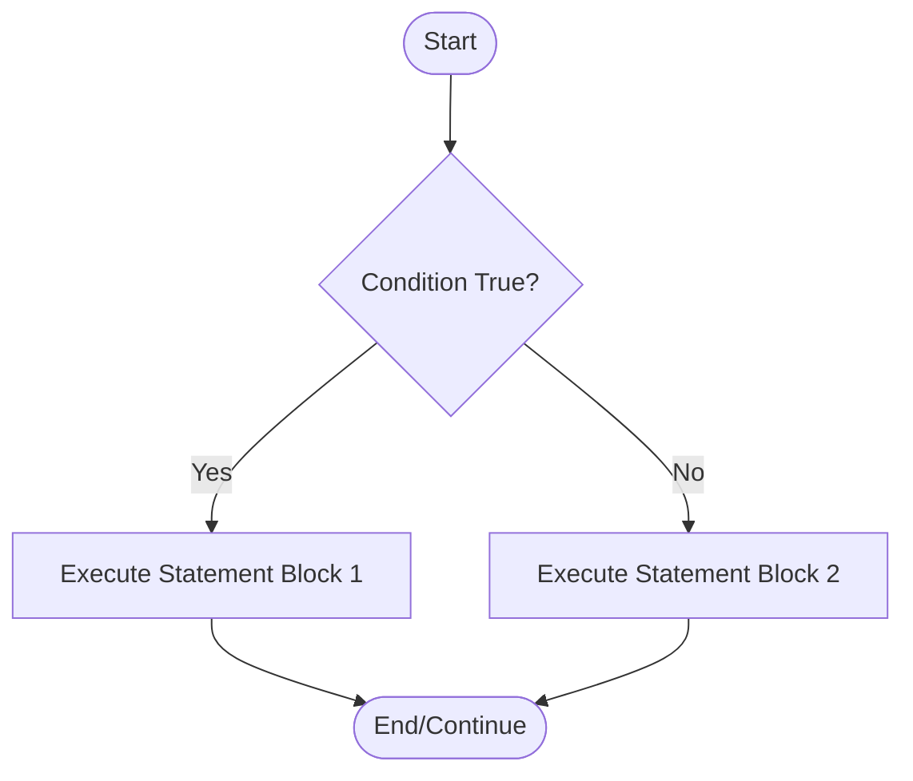

# Day 4: Conditional and Control Statements

Welcome to Day 4! Until now, our programs have run sequentially, line by line, from top to bottom. But in the real world, programs need to make decisions. For example, *if* a user's password is correct, log them in; *else*, show an error message.

Control statements allow us to dictate the flow of program execution based on certain conditions.

---

## 🚦 1. What are Control Statements?

Control statements are statements that alter the normal sequential flow of execution in a program. In Java, decision-making (conditional) statements evaluate a boolean expression (which evaluates to `true` or `false`) and then execute a block of code accordingly.

### Control Flow Diagram



---

## 🔀 2. The `if` and `if-else` Statements

The `if` statement is the most basic control flow statement. It tells the program to execute a certain section of code *only if* a particular test evaluates to `true`.

### Types of `if` statements:
1. Simple `if`
2. `if-else`
3. `if-else-if` ladder
4. Nested `if`

### Code Examples

**1. Simple `if`**
```java
int age = 20;
if (age >= 18) {
    System.out.println("You are an adult.");
}
// Outputs: You are an adult.
```

**2. `if-else`**
```java
int number = 10;
if (number % 2 == 0) {
    System.out.println("Even number");
} else {
    System.out.println("Odd number");
}
// Outputs: Even number
```

**3. `if-else-if` ladder**
Used when there are multiple distinct conditions to check.
```java
int marks = 85;
if (marks >= 90) {
    System.out.println("Grade A");
} else if (marks >= 80) {
    System.out.println("Grade B");
} else if (marks >= 70) {
    System.out.println("Grade C");
} else {
    System.out.println("Grade F");
}
// Outputs: Grade B
```

---

## 🎛️ 3. The `switch` Statement

The `switch` statement allows a variable to be tested for equality against a list of values. Each value is called a `case`. It's often used as a cleaner alternative to a long `if-else-if` ladder when comparing a single variable against specific constants.

### How it works
1. The `switch` expression is evaluated once.
2. The value is compared with the values of each `case`.
3. If there is a match, the associated block of code is executed.
4. The `break` keyword breaks out of the switch block, preventing "fall-through".
5. The `default` keyword specifies some code to run if there is no case match (like the `else` block).

### Code Example

```java
int day = 4;
switch (day) {
  case 1:
    System.out.println("Monday");
    break;
  case 2:
    System.out.println("Tuesday");
    break;
  case 3:
    System.out.println("Wednesday");
    break;
  case 4:
    System.out.println("Thursday");
    break;
  case 5:
    System.out.println("Friday");
    break;
  default:
    System.out.println("Weekend");
}
// Outputs: Thursday
```

> [!WARNING]
> **The Fall-Through Effect:** If you forget the `break;` statement inside a case, Java will execute the matching case AND all subsequent cases until it hits a break or the switch ends!

---

## ⚖️ `if-else-if` vs `switch`

| Feature | `if-else-if` | `switch` |
| :--- | :--- | :--- |
| **Expression Type** | Evaluates a boolean expression (`true`/`false`). | Evaluates a single value (byte, short, int, char, String, Enum). |
| **Use Case** | Best for ranges (e.g., `x > 10 && x < 20`) and complex logical conditions. | Best for comparing a single variable against multiple exact values. |
| **Performance** | Can be slower for many conditions (checks sequentially). | Often faster (compiler can optimize it using a jump table). |
| **Syntax** | Can get messy with many conditions. | Very clean and readable for discrete values. |

---

## 📝 Learning & Assignments
- **Learning:** Open the `Learning/` folder to run code examples related to complex conditional checks and switch statements.
- **Assignments:** Complete the `Assignments/` exercises. Try building a basic calculator using `switch` and a grading system using `if-else`.
