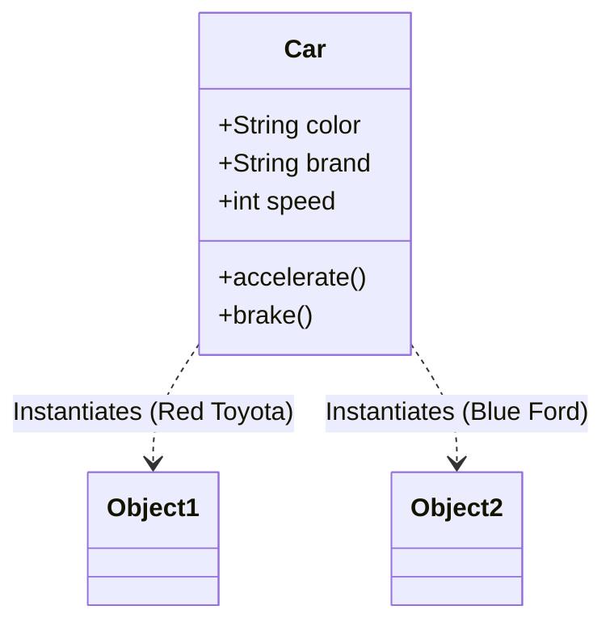

# Day 6: OOP Practical Understanding

Welcome to Day 6! On Day 1, we introduced the theoretical concept of Object-Oriented Programming (OOP). Today, we dive into how to actually *write* object-oriented code in Java. We'll learn about Classes, Objects, Constructors, and Methods.

---

## 🏗️ 1. Classes and Objects

In Java, everything is associated with classes and objects.

- **Class:** A blueprint or template for creating objects. It defines the state (fields/variables) and behavior (methods) that the objects created from it will have.
- **Object:** An instance of a class. It represents a real-world entity that has state and behavior.

### Conceptual Diagram


---

## 💻 2. Defining a Class and Creating Objects

Let's look at how to code the `Car` class in Java.

```java
// Defining the Class (Blueprint)
class Car {
    // Attributes / State (Instance Variables)
    String color;
    String brand;
    int speed;

    // Behavior (Method)
    void accelerate() {
        speed += 10;
        System.out.println("The " + brand + " is now going " + speed + " km/h.");
    }
}

public class Main {
    public static void main(String[] args) {
        // Creating an Object (Instance)
        Car myCar = new Car(); 
        
        // Setting state
        myCar.brand = "Toyota";
        myCar.color = "Red";
        myCar.speed = 0;
        
        // Invoking behavior
        myCar.accelerate(); // The Toyota is now going 10 km/h.
    }
}
```

### The `new` Keyword
The `new` keyword is used to allocate memory at runtime (on the Heap) for the new object. Without it, you just have a reference variable pointing to `null`.

---

## 🛠️ 3. Constructors

A constructor is a special block of code that is called when an object is instantiated. It looks like a method, but it has the **exact same name as the class** and **no return type** (not even `void`).

### Purpose of Constructors
The primary purpose of a constructor is to initialize the state of an object as soon as it is created.

### Types of Constructors

| Type | Description |
| :--- | :--- |
| **Default Constructor** | Provided by Java if you don't write any constructor. Initializes fields to default values (0, null, false). |
| **No-arg Constructor** | Explicitly written by the programmer without any parameters. |
| **Parameterized Constructor** | Takes arguments to initialize the object with specific values upon creation. |

### Code Example

```java
class Person {
    String name;
    int age;

    // 1. No-arg constructor
    Person() {
        name = "Unknown";
        age = 0;
    }

    // 2. Parameterized constructor
    Person(String n, int a) {
        name = n;
        age = a;
    }
    
    void display() {
        System.out.println("Name: " + name + ", Age: " + age);
    }
}

public class Main {
    public static void main(String[] args) {
        Person p1 = new Person(); // Calls no-arg constructor
        Person p2 = new Person("Alice", 25); // Calls parameterized constructor
        
        p1.display(); // Name: Unknown, Age: 0
        p2.display(); // Name: Alice, Age: 25
    }
}
```

> [!NOTE]
> **Constructor Overloading:** As seen above, having multiple constructors with different parameter lists in the same class is called constructor overloading.

---

## 🔑 4. The `this` Keyword

The `this` keyword in Java is a reference variable that refers to the **current object**. 

It is mainly used to resolve ambiguity between instance variables and parameters if they have the same name.

```java
class Student {
    String name; // Instance variable
    
    // Parameter 'name' has the same identifier as instance variable
    Student(String name) {
        // 'this.name' refers to the object's variable
        // 'name' refers to the parameter passed in
        this.name = name; 
    }
}
```

---

## 📝 Learning & Assignments
- **Learning:** Go to the `Learning/` folder to run code related to classes, objects, and constructors.
- **Assignments:** Complete the `Assignments/` folder exercises. Try modeling a real-world entity like a `BankAccount` or a `LibraryBook` with fields, constructors, and methods.
