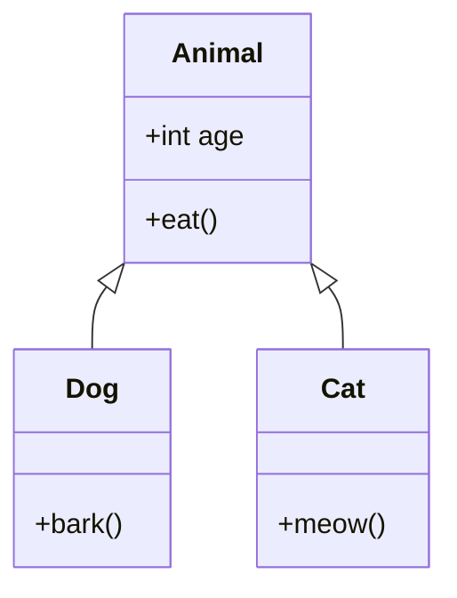

# Day 7: Advanced OOP

Welcome to Day 7! Today we dive into the core pillars of Object-Oriented Programming that make it so powerful: **Inheritance**, **Polymorphism**, and **Abstraction**. We'll also cover access modifiers to understand **Encapsulation**.

---

## 🧬 1. Inheritance

Inheritance allows a new class (subclass/derived class) to inherit the attributes and methods of an existing class (superclass/base class). This promotes code reusability.

The `extends` keyword is used to inherit from a class.

### Conceptual Diagram



### Code Example
```java
// Superclass
class Animal {
    void eat() {
        System.out.println("This animal eats food.");
    }
}

// Subclass inheriting Animal
class Dog extends Animal {
    void bark() {
        System.out.println("The dog barks.");
    }
}

public class Main {
    public static void main(String[] args) {
        Dog myDog = new Dog();
        myDog.eat();  // Inherited method!
        myDog.bark(); // Its own method
    }
}
```

### The `super` Keyword
The `super` keyword refers to the parent class object. It is used to call superclass methods and access superclass constructors.
```java
class Dog extends Animal {
    Dog() {
        super(); // Calls the Animal constructor
    }
    void eat() {
        super.eat(); // Calls the Animal's eat() method
        System.out.println("Dog eats kibble.");
    }
}
```

---

## 🎭 2. Polymorphism

Polymorphism means "many forms". It allows us to perform a single action in different ways. In Java, it is mainly achieved through **Method Overloading** and **Method Overriding**.

### Overloading vs Overriding

| Feature | Method Overloading (Compile-time) | Method Overriding (Run-time) |
| :--- | :--- | :--- |
| **Where it happens** | Inside the same class | In parent and child classes (Inheritance) |
| **Method Signature** | Must have different parameters (type, number, or order) | Must have the exact same parameters and return type |
| **Purpose** | To increase the readability of the program | To provide a specific implementation of a parent's method |

### Method Overriding Example
```java
class Animal {
    void makeSound() {
        System.out.println("Generic animal sound");
    }
}

class Cat extends Animal {
    @Override // Annotation to tell compiler we are overriding
    void makeSound() {
        System.out.println("Meow");
    }
}
```

---

## 🔒 3. Encapsulation & Access Modifiers

Encapsulation is the mechanism of hiding data (variables) and code acting on the data (methods) together as a single unit. We achieve this using **Access Modifiers**.

| Modifier | Class | Package | Subclass | World |
| :--- | :---: | :---: | :---: | :---: |
| `public` | ✅ | ✅ | ✅ | ✅ |
| `protected` | ✅ | ✅ | ✅ | ❌ |
| *default* (no keyword) | ✅ | ✅ | ❌ | ❌ |
| `private` | ✅ | ❌ | ❌ | ❌ |

### Best Practice (Getters & Setters)
Always make your instance variables `private` and provide `public` getter and setter methods to access and update the value.

```java
class Person {
    private String name; // Hidden data

    // Getter
    public String getName() {
        return name;
    }

    // Setter
    public void setName(String name) {
        this.name = name;
    }
}
```

---

## ☁️ 4. Abstraction (Abstract Classes)

Abstraction is the process of hiding the implementation details and showing only functionality to the user. We can use **Abstract Classes** to achieve this (from 0 to 100% abstraction).

- An abstract class is declared with the `abstract` keyword.
- It cannot be instantiated (you cannot use `new AbstractClass()`).
- It can have abstract methods (methods without a body) and regular methods.

### Code Example
```java
abstract class Shape {
    // Abstract method (no body)
    abstract void draw();
    
    // Regular method
    void color() {
        System.out.println("Adding color...");
    }
}

class Circle extends Shape {
    // MUST implement the abstract method
    void draw() {
        System.out.println("Drawing a circle");
    }
}
```

---

## 📝 Learning & Assignments
- **Learning:** Dive into the `Learning/` folder to see complex examples involving polymorphism, abstract classes, and encapsulation.
- **Assignments:** Complete the `Assignments/` folder exercises. Try building a hierarchical structure like `Employee -> Manager -> Executive` using inheritance and overridden methods!
