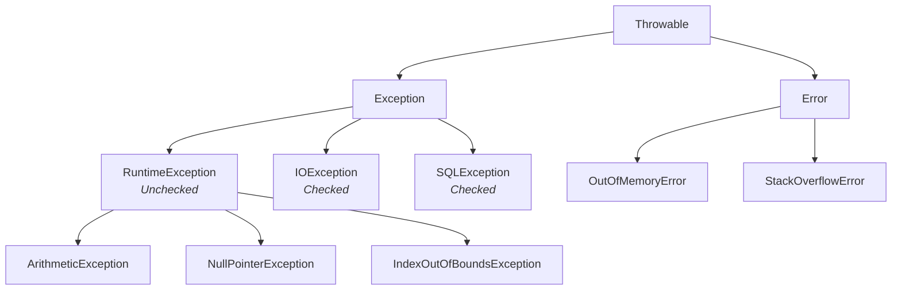

# Day 8: Exception Handling

Welcome to Day 8! No matter how well you write your code, things can go wrong. A user might enter text when you expect a number, a file might be missing, or the network connection could fail. 

In Java, an **Exception** is an unwanted or unexpected event occurring during the execution of a program (at runtime) that disrupts the normal flow of instructions.

---

## 🚨 1. The Exception Hierarchy

All exception classes in Java are derived from the `java.lang.Throwable` class.



### Exceptions vs Errors

| Category | Description | Examples | Recovery |
| :--- | :--- | :--- | :--- |
| **Exception** | Conditions that a reasonable application might want to catch. Caused by your program or the environment. | `NullPointerException`, `FileNotFoundException` | Can be caught and recovered from. |
| **Error** | Serious problems that a reasonable application should not try to catch. Usually JVM level issues. | `OutOfMemoryError`, `StackOverflowError` | Generally unrecoverable. Program crashes. |

---

## ✅ 2. Checked vs Unchecked Exceptions

| Feature | Checked Exceptions | Unchecked Exceptions |
| :--- | :--- | :--- |
| **Verification** | Checked at **Compile-time**. | Checked at **Run-time**. |
| **Handling** | The compiler forces you to handle them (try-catch or throws). | The compiler does not force you to handle them. |
| **Classes** | All classes inheriting `Exception` EXCEPT `RuntimeException`. | Classes inheriting `RuntimeException`. |
| **Examples** | `IOException`, `SQLException` | `ArithmeticException`, `NullPointerException` |

---

## 🛠️ 3. Handling Exceptions (`try-catch-finally`)

Java provides five keywords to handle exceptions: `try`, `catch`, `finally`, `throw`, and `throws`.

### Syntax Block
```java
try {
    // Code that might throw an exception
} catch (ExceptionType1 e1) {
    // Code to handle ExceptionType1
} catch (ExceptionType2 e2) {
    // Code to handle ExceptionType2
} finally {
    // Code that ALWAYS executes, regardless of exception occurring or not
}
```

### Code Example
```java
public class ExceptionExample {
    public static void main(String[] args) {
        try {
            int result = 10 / 0; // Throws ArithmeticException
            System.out.println("Result: " + result); // This line is skipped
        } catch (ArithmeticException e) {
            System.out.println("Error: Cannot divide by zero!");
            // e.printStackTrace(); // Optional: prints the full stack trace
        } finally {
            System.out.println("This block always runs. Used for cleanup.");
        }
    }
}
```

---

## 📤 4. The `throw` and `throws` Keywords

### The `throw` keyword
Used to explicitly throw an exception from a method or any block of code.
```java
public void checkAge(int age) {
    if (age < 18) {
        throw new IllegalArgumentException("Age must be 18 or older.");
    }
}
```

### The `throws` keyword
Used in the method signature to declare that this method *might* throw an exception, passing the responsibility of handling it to the method caller.

```java
import java.io.*;

public class FileHandler {
    // We declare throws because reading a file is a Checked Exception
    public void readFile() throws IOException {
        FileReader file = new FileReader("C:\\nonexistent.txt");
        BufferedReader fileInput = new BufferedReader(file);
        
        // This causes an IOException
        System.out.println(fileInput.readLine()); 
        fileInput.close();
    }
}
```

### Differences at a Glance
| Feature | `throw` | `throws` |
| :--- | :--- | :--- |
| **Purpose** | Used to actually throw an exception object. | Used to declare that an exception might occur. |
| **Location** | Used *inside* the method body. | Used in the method *signature*. |
| **Usage** | You can only throw one exception at a time. | You can declare multiple exceptions (e.g., `throws IOException, SQLException`). |

---

## 📝 Learning & Assignments
- **Learning:** Go to the `Learning/` folder to run examples demonstrating try-catch blocks, multiple catches, and finally blocks.
- **Assignments:** Complete the `Assignments/` folder exercises. Try creating your own **Custom Exception** class by extending `Exception`!
