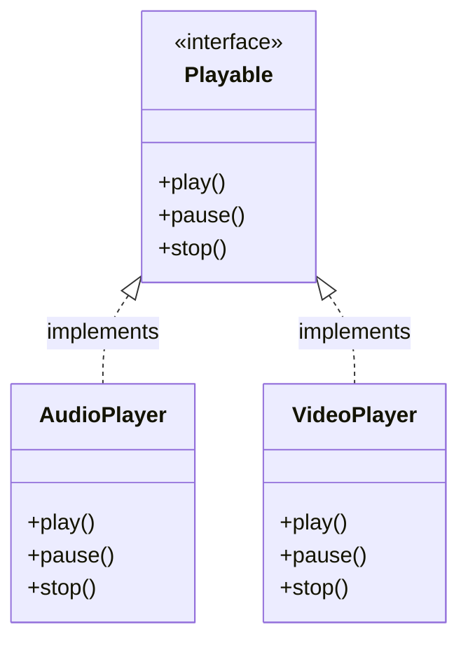

# Day 9: Interfaces in Java

Welcome to Day 9! In Day 7, we learned about Abstract Classes. Today, we will look at **Interfaces**, which provide a way to achieve 100% abstraction in Java. 

Interfaces act as a strict contract: any class that implements an interface MUST provide the implementation for all its methods.

---

## 🔌 1. What is an Interface?

An interface in Java is a blueprint of a class. It contains static constants and abstract methods.
- The interface is defined using the `interface` keyword.
- A class uses the `implements` keyword to implement an interface.

### Why use Interfaces?
1. **Total Abstraction:** Unlike abstract classes, which can have both abstract and concrete (regular) methods, interfaces (prior to Java 8) can only have abstract methods.
2. **Multiple Inheritance:** Java does not support multiple inheritance with classes (a class cannot extend two classes). However, a class can implement multiple interfaces!
3. **Loose Coupling:** It helps to separate the definition of a method from its implementation.

### Conceptual Diagram



---

## 💻 2. Implementing an Interface

Let's see how this works in code.

```java
// Defining the interface
interface Animal {
    // By default, variables are public, static, and final
    int MAX_AGE = 100;
    
    // By default, methods are public and abstract
    void makeSound();
    void sleep();
}

// Implementing the interface
class Dog implements Animal {
    // Must provide implementation for all abstract methods
    public void makeSound() {
        System.out.println("Woof woof!");
    }
    
    public void sleep() {
        System.out.println("Zzz...");
    }
}

public class Main {
    public static void main(String[] args) {
        Dog myDog = new Dog();
        myDog.makeSound();
        myDog.sleep();
        System.out.println("Max age of any animal: " + Animal.MAX_AGE);
    }
}
```

---

## 🔀 3. Multiple Inheritance via Interfaces

While a class can only `extends` ONE superclass, it can `implements` MULTIPLE interfaces.

```java
interface Printable {
    void print();
}

interface Showable {
    void show();
}

// Multiple Inheritance
class Document implements Printable, Showable {
    public void print() {
        System.out.println("Printing document...");
    }
    
    public void show() {
        System.out.println("Showing document on screen...");
    }
}
```

---

## ⚖️ 4. Abstract Class vs Interface

This is one of the most common interview questions in Java. When should you use which?

| Feature | Abstract Class | Interface |
| :--- | :--- | :--- |
| **Methods** | Can have both abstract and non-abstract methods. | Only abstract methods (until Java 8 introduced `default` and `static` methods). |
| **Variables** | Can have final, non-final, static, and non-static variables. | Variables are ALWAYS `public static final` by default. |
| **Inheritance** | A class can extend only ONE abstract class. | A class can implement MULTIPLE interfaces. |
| **Access Modifiers** | Can use `private`, `protected`, etc. | Methods are `public` by default. |
| **Usage** | Use when classes share closely related characteristics or code. | Use when unrelated classes need to share a common behavior (e.g., `Serializable`, `Runnable`). |

---

## 🚀 5. Java 8+ Additions to Interfaces

Starting with Java 8, interfaces became more powerful. They are no longer restricted to just abstract methods.

1. **Default Methods:** Interfaces can have methods with a body using the `default` keyword. This allows adding new methods to interfaces without breaking existing classes that implement them.
2. **Static Methods:** Interfaces can have `static` methods, just like classes.

```java
interface Vehicle {
    void drive(); // Abstract
    
    // Default method
    default void honk() {
        System.out.println("Beep beep!");
    }
    
    // Static method
    static void showRules() {
        System.out.println("Stop at red lights.");
    }
}
```

---

## 📝 Learning & Assignments
- **Learning:** Open the `Learning/` folder to run examples of interfaces, multiple inheritance, and default methods.
- **Assignments:** Complete the `Assignments/` exercises. Try defining an interface `Shape` and implementing it in `Circle`, `Rectangle`, and `Triangle` classes.
